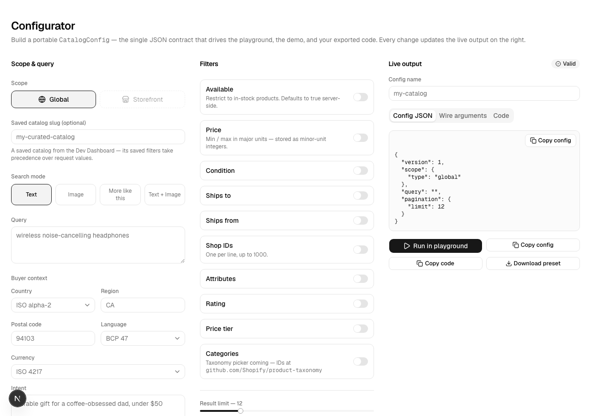
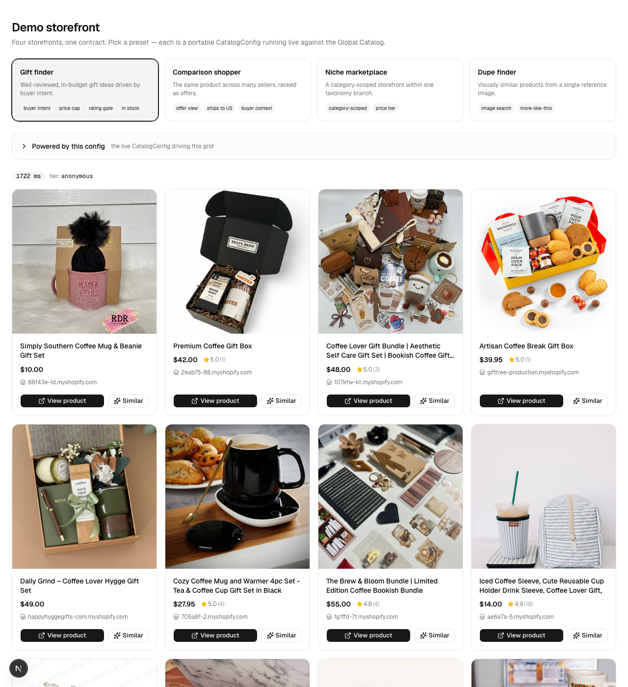

<div align="center">

# catalog-kit

**The entire Shopify product catalog, in your app, in ~2 minutes after install. No API key. MIT licensed.**

[](https://github.com/DevCreate-Studio/catalog-kit/actions/workflows/ci.yml)
[](./LICENSE)
[](./CONTRIBUTING.md)

</div>

Building on Shopify's **Global Catalog** (UCP) today means reading the spec, learning JSON‑RPC‑over‑MCP, hosting an agent profile, exchanging a JWT, and hand‑writing filter payloads before you see a single product. `catalog-kit` deletes that day of yak‑shaving. Clone it and you get a typed client, a visual configurator, a live playground, and a working demo storefront — searching **millions of products across every merchant on the network, keyless**, in about two minutes. One portable `CatalogConfig` JSON is the contract that drives all of it and the code you export.

---

## 60‑second quickstart

```bash
git clone https://github.com/DevCreate-Studio/catalog-kit
cd catalog-kit
pnpm install
pnpm dev
# → open http://localhost:3000
```

> **No API key needed.** The kit defaults to the anonymous keyless tier — it works against the real Global Catalog on first run, no signup, no credentials. Add Dev Dashboard credentials later only to raise rate limits (see [getting‑started](./docs/getting-started.md)).

Requirements: **Node 20.19+ / 22.12+ / 24 (24 recommended)**, **pnpm 11** (`corepack enable`).

---

## Configure it visually

Toggle scope, search mode, filters, and buyer context; watch the `CatalogConfig` JSON and the exact JSON‑RPC arguments update live; then **Copy code**, **Download preset**, or **Run in playground**.



---

## What you can build

Four presets ship in [`examples/`](./examples), each a portable config you can open in the [configurator](http://localhost:3000/configure), run in the [playground](http://localhost:3000/playground), or load in the [demo](http://localhost:3000/demo).

| Preset | What it shows | Config highlight | Try it |
| --- | --- | --- | --- |
| **Gift finder** | Well‑reviewed, in‑budget ideas driven by buyer intent | `context.intent` + `price.max` + `rating.variant.min` | [config](./examples/gift-finder.config.json) · [demo](http://localhost:3000/demo) |
| **Comparison shopper** | The same product across many sellers, ranked as offers | `view: "offer"` + `ships_to` | [config](./examples/comparison-shopper.config.json) · [demo](http://localhost:3000/demo) |
| **Niche marketplace** | A category‑scoped storefront within one taxonomy branch | `filters.categories` (GID) + `price_tier` | [config](./examples/niche-marketplace.config.json) · [demo](http://localhost:3000/demo) |
| **Dupe finder** | Visually similar products from one reference image | `like: [{ image_url }]` — image search | [config](./examples/dupe-finder.config.json) · [demo](http://localhost:3000/demo) |



---

## What's in the box

| | |
| --- | --- |
| **Typed client** (`packages/catalog-client`) | `searchCatalog`, `lookupCatalog`, `getProduct` — profile injection, retry/backoff, 12s timeout, anonymous ↔ token auth ladder. Fetch‑native, runs on Node, Vercel, and Workers. |
| **Configurator** | Three‑panel visual builder: every filter and search mode as a control, live `CatalogConfig` + wire‑argument output, shareable via URL hash. |
| **Playground** | Raw config → response inspector across all three tools, with Products / Raw JSON / Messages / Request tabs. |
| **Demo storefront** | Preset‑driven product grid with more‑like‑this, load‑more, and a live "powered by this config" panel. |
| **Agent‑ready** | `AGENTS.md` source of truth, a Claude Code skill, JSON Schema for configs, `llms.txt`, and recorded fixtures so agents build and test offline. |
| **Compliance‑safe** | No results caching, images rendered hot‑linked (never re‑hosted), rate‑limit‑aware transport, endpoint URLs pinned in one file — by design. See [compliance](./docs/compliance.md). |

---

## Build it with an agent

The repo is a first‑class agent workspace. Hand your coding agent one line:

```text
Clone github.com/DevCreate-Studio/catalog-kit and read AGENTS.md,
then build me a <your idea> on the Global Catalog.
```

[`AGENTS.md`](./AGENTS.md) is the single source of truth (repo map, commands, API gotchas, playbooks). The config JSON has a generated [JSON Schema](./packages/catalog-client/schema/catalog-config.schema.json), and recorded fixtures let the test suite run with no keys and no network.

---

## Documentation

The README sells; the docs teach.

| Doc | What it covers |
| --- | --- |
| [Getting started](./docs/getting-started.md) | Clone → dev keyless path, agent profiles, optional credentials, first query |
| [Configuration](./docs/configuration.md) | Every filter and param — shape, real payload, gotchas; validated behavior table |
| [API reference](./docs/api-reference.md) | Auth tier ladder, the three tools, `CatalogError` codes, `messages[]` contract |
| [Recipes](./docs/recipes.md) | Full runnable app patterns — gift finder, query‑variant union, dupe finder, price watcher |
| [Agent guide](./docs/agent-guide.md) | Building with AI agents — why the repo is agent‑ready, copy‑paste prompts, wrapping the client in your own agent |
| [Compliance](./docs/compliance.md) | How to not get cut off: no caching, hot‑linked images, rate limits per tier |
| [Deployment](./docs/deployment.md) | One‑click Vercel deploy, Cloudflare Workers, hosting your agent profile |
| [Troubleshooting](./docs/troubleshooting.md) | Empty results, 429s, profile fetch failures, "works local, fails deployed" |
| [Architecture](./docs/architecture.md) | The repo tree annotated, the config‑contract data flow, why lenient schemas, why no cache |
| [AGENTS.md](./AGENTS.md) | The agent source of truth — commands, conventions, gotchas, playbooks |

---

## Showcase

Built something on the Global Catalog with this kit? Add it to [`SHOWCASE.md`](./SHOWCASE.md) via PR — presets are the easiest contribution.

## Contributing

Contributors never need API keys — tests run against recorded fixtures. See [`CONTRIBUTING.md`](./CONTRIBUTING.md) for setup, the Changesets flow, and the rule that keeps `AGENTS.md` current.

## License

[MIT](./LICENSE) © 2026 DevCreate Studio.

Created by [Alex ElChehimi](https://x.com/alex_chehimi) · [DevCreate.Studio](https://devcreate.studio)

---

<sub>Not affiliated with, endorsed by, or sponsored by Shopify. "Shopify" is a trademark of Shopify Inc. This project uses Shopify's public Universal Commerce Protocol (UCP) catalog surface under its published usage guidelines.</sub>
